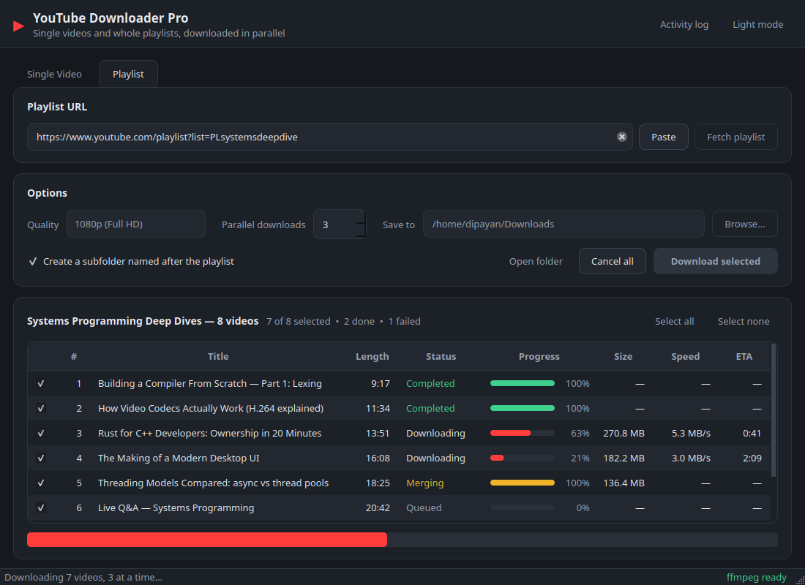
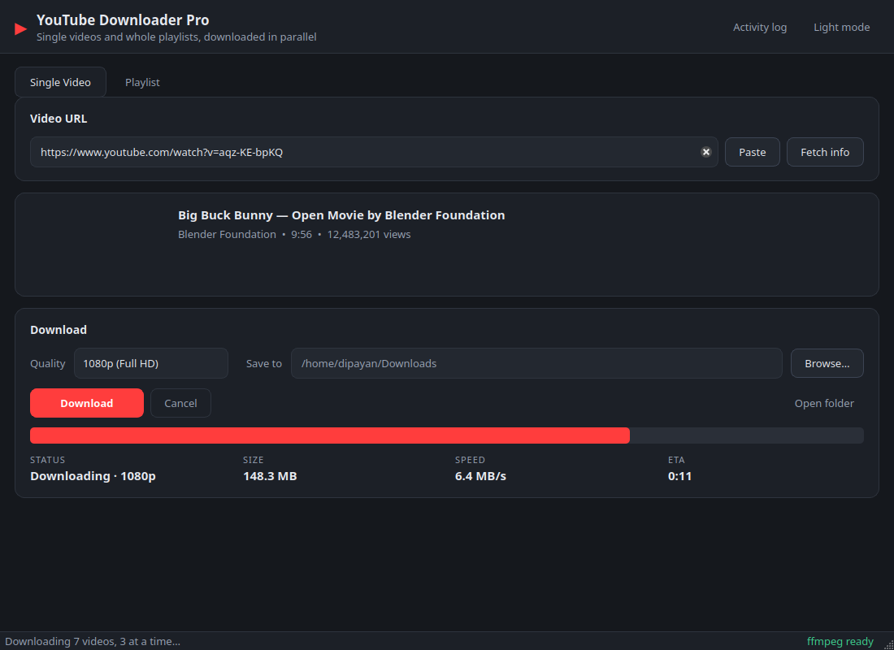
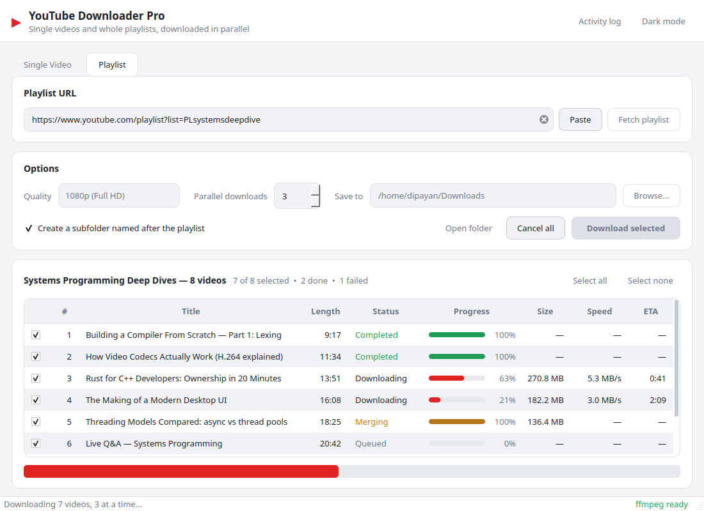

# YouTube Downloader Pro

A desktop YouTube downloader built with **PySide6 (Qt)** and **yt-dlp**. Download a single
video, or queue a whole playlist and pull several videos down at once — with live per-video
progress, speed and ETA.



---

## Features

**Playlist downloads, in parallel**
- Fetch any playlist and see every video in a sortable queue before committing to anything.
- Tick and untick individual videos; download only what you want.
- **You choose how many download at the same time** (1–8). The rest wait in a queue and start
  as slots free up, so a 500-video playlist does not spawn 500 threads.
- Change the parallel limit *while a run is in progress* — it applies to everything still queued.
- One dead or region-blocked video fails on its own row and the rest of the run carries on.
- Optional playlist subfolder, with files numbered in playlist order.

**Single video**
- Fetch info first: thumbnail, title, channel, duration and view count before you download.
- Live progress bar with size, speed and ETA.

**Throughout**
- Cancel cleanly at any point — a whole run, or one video from its right-click menu.
- Dark and light themes.
- Twelve quality presets from 4K down to 144p, plus MP3 and M4A audio extraction.
- Sub-1080p presets prefer **H.264 + AAC**, so the files play on anything. 1440p/4K take the
  best available stream, since YouTube only publishes those as VP9/AV1.
- An activity log you can open when something goes wrong.
- Your folder, quality, theme and parallel limit are remembered between sessions.

| Single video | Light theme |
|---|---|
|  |  |

---

## Install

Requires **Python 3.10+**.

```bash
git clone https://github.com/ddipayan00/YouTubeDownloaderPro.git
cd YouTubeDownloaderPro

python3 -m venv .venv
source .venv/bin/activate          # Windows: .venv\Scripts\activate
pip install -r requirements.txt

python run.py
```

### ffmpeg is required

This is not optional in practice. **YouTube now publishes video and audio as separate
streams** — a typical video has *zero* combined formats — so ffmpeg has to merge them.
Without it you are limited to whatever single-file format a video happens to offer, and
most offer none. Audio extraction to MP3 also needs it.

The app finds ffmpeg in either of two places:

1. **On your PATH** — the normal system install:
   ```bash
   sudo apt install ffmpeg        # Debian / Ubuntu
   brew install ffmpeg            # macOS
   winget install Gyan.FFmpeg     # Windows
   ```
2. **In this project's `bin/` folder** — drop `ffmpeg` (and `ffprobe`) there and the app
   picks them up with no system install. This is also what gets bundled into a build.
   `bin/` is gitignored, so the binaries never end up in the repository.

The status bar tells you which state you are in on every launch.

---

## Using it

**A single video** — paste a URL, optionally hit *Fetch info* to confirm it is the right
video, pick a quality and folder, then *Download*.

**A playlist** — paste a playlist URL and hit *Fetch playlist*. Every video appears in the
queue. Untick anything you do not want, set **Parallel downloads**, then *Download selected*.

Right-click any row in the queue to cancel just that video, copy its URL, open it in a
browser, or copy the error if it failed.

### Choosing a parallel limit

3 is a sensible default. Higher is faster on a fast connection, but YouTube will start
throttling or rejecting requests if you push it, and failures cost more time than the extra
parallelism saves. If you see videos failing in bursts, lower it.

### Keyboard shortcuts

| Shortcut | Action |
|---|---|
| `Ctrl+D` / `Ctrl+P` | Switch to the Single Video / Playlist tab |
| `Ctrl+L` | Show or hide the activity log |
| `Ctrl+T` | Toggle dark / light theme |
| `Ctrl+Q` | Quit |

### Cancelled downloads

Cancelling leaves yt-dlp's `.part` files in the download folder on purpose — resuming picks
up where it stopped. Delete them by hand if you do not intend to resume.

---

## Building standalone executables

**PyInstaller cannot cross-compile.** There is no flag that turns a Linux machine into a
Windows build host: the bootloader it stamps into the output is a native binary for the OS
that ran it, and it bundles that machine's Python and Qt libraries. A `.exe` has to be built
on Windows, a `.app` on macOS, an ELF binary on Linux.

That leaves two honest options — build on each OS, or let CI do it for you.

### Option 1 — build for the machine you are on

```bash
pip install -e ".[dev]"
python tools/fetch_ffmpeg.py          # static ffmpeg + ffprobe into bin/
pyinstaller --noconfirm youtube-downloader-pro.spec
python tools/smoke_test.py            # launches the result and checks it works
```

| Host | Output |
|---|---|
| Linux | `dist/youtube-downloader-pro/` (run the binary inside) |
| Windows | `dist/youtube-downloader-pro/youtube-downloader-pro.exe` |
| macOS | `dist/YouTube Downloader Pro.app` |

`tools/fetch_ffmpeg.py` pulls a **static** build on purpose. Copying your package
manager's ffmpeg would bundle a binary dynamically linked against your machine's
libraries, and it would fail to start on anyone else's.

### Option 2 — build all four at once in CI

`.github/workflows/build.yml` runs the same steps on four runners — Linux, Windows,
macOS Apple Silicon and macOS Intel — and uploads one archive per platform. This is the
only way to produce every executable without owning every machine.

```bash
git tag v2.0.0 && git push origin v2.0.0
```

Pushing a `v*` tag also attaches the four archives to a GitHub release. Pushes and PRs to
`main` build the same artifacts without releasing, so packaging breakage shows up as a red
check rather than as a surprise on release day.

### What the build includes

Anything in `bin/` is bundled, so the app runs on a machine with no Python and no ffmpeg.
The runtime looks for ffmpeg in `sys._MEIPASS/bin`, next to the executable, and in
`Contents/Resources/bin` on macOS, which covers every layout the spec can produce.

The spec strips Qt modules a widgets-only app never loads (Qml, Quick, Pdf, VirtualKeyboard).
Listing them under `excludes` is not enough — PyInstaller pulls them in as binary
dependencies of Qt plugins, so they are filtered out of the collected trees after analysis.
UPX is deliberately off: it trips Windows SmartScreen and AV heuristics and invalidates
macOS code signatures.

Expect roughly **315 MB** on disk, about half of which is ffmpeg and ffprobe. Dropping
ffprobe from the spec saves ~76 MB if you are willing to require a system ffmpeg.

### Signing

The builds are unsigned. Windows shows a SmartScreen warning; macOS refuses to open the app
until you right-click → Open, or clear the quarantine flag:

```bash
xattr -dr com.apple.quarantine "YouTube Downloader Pro.app"
```

Signing needs a paid Apple Developer ID or an Authenticode certificate — add the signing
step to the workflow once you have one.

---

## Project layout

```
ytdpro/
├── app.py                 Entry point: QApplication setup
├── settings.py            Persisted preferences (QSettings)
├── core/                  No Qt imports — usable from a script or a test
│   ├── engine.py          yt-dlp wrapper: metadata, download, ffmpeg discovery
│   ├── formats.py         Quality presets and their format selectors
│   ├── tasks.py           DownloadTask / Progress / TaskStatus + formatting
│   └── workers.py         QRunnable workers and the parallel DownloadPool
└── ui/
    ├── main_window.py     Shell: header, tabs, activity log, status bar
    ├── single_tab.py      Single video tab
    ├── playlist_tab.py    Playlist tab
    ├── playlist_model.py  Queue table model + progress-bar delegate
    ├── theme.py           Palettes and the generated stylesheet
    └── common.py          Shared widgets (Card, StatRow)

tools/
├── fetch_ffmpeg.py        Downloads a static ffmpeg/ffprobe for this platform
└── smoke_test.py          Launches a packaged build and verifies it starts
```

**How the threading works.** Every blocking yt-dlp call runs in a `QRunnable` on a
`QThreadPool`; results come back as Qt signals, which are delivered on the GUI thread, so no
widget is ever touched from a worker. The "parallel downloads" spinner is wired straight to
`QThreadPool.setMaxThreadCount()` — submitted work beyond that limit queues instead of
running. Cancellation is a `threading.Event` per task that the yt-dlp progress hook checks
on every callback.

`core/` deliberately imports no Qt, so the download engine can be driven from a plain script:

```python
from pathlib import Path
from ytdpro.core.engine import download, fetch_playlist
from ytdpro.core.formats import preset_by_label

title, tasks = fetch_playlist("https://www.youtube.com/playlist?list=…")
download(tasks[0], Path("~/Downloads").expanduser(), preset_by_label("1080p (Full HD)"))
```

## Tests

```bash
pip install pytest
python -m pytest
```

Covers the pure logic — format selection and its ffmpeg fallback, byte/duration/speed
formatting, task state, error translation and folder-name sanitisation. No network needed.

---

## History

This started life as a college project: a single-file Tkinter GUI over `pytube`
(`ytvd.py`, credited to Aditya Bagad), later reworked into a `ttkbootstrap` app whose
playlist tab never got finished. Version 2 is a ground-up rewrite on Qt, and the playlist
feature is the part that finally landed.

## Legal

For downloading content you have the right to download — your own uploads, Creative Commons
material, or anything the copyright holder permits. Downloading copyrighted video may breach
YouTube's Terms of Service. That is on you.

## License

MIT — see [LICENSE](LICENSE).
